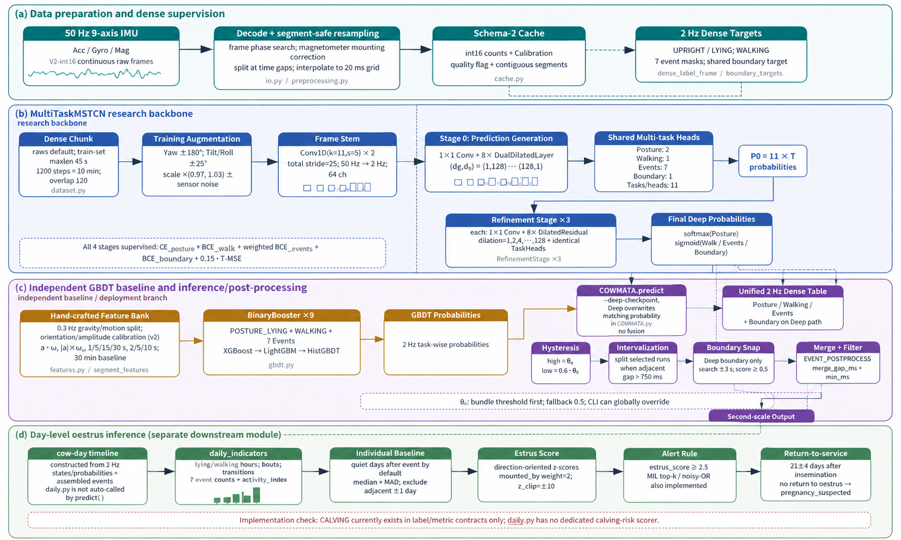

<div align="center">
  <a href="https://www.cowmata.com/en/">
    
  </a>

  <h1>COWMATA Tail-Sensor Intelligence</h1>

  <p><strong>Continuous cattle behavior and reproductive-event intelligence from tail-mounted multimodal sensing.</strong></p>
  <p>A research and engineering baseline for 50 Hz IMU processing, video-aligned annotation, cow-independent evaluation, event candidate mining, and production-oriented inference.</p>

  <p>
    <a href="https://github.com/zxq309/cowmata-tailring/actions/workflows/ci.yml"></a>
    <a href="https://github.com/zxq309/cowmata-tailring/releases/tag/v0.3.0"></a>
    
    
    
    
  </p>
</div>

[English](README.md) | [简体中文](README.zh-CN.md)


> [!IMPORTANT]
> This repository is a validated algorithm-engineering baseline, not a standalone veterinary diagnostic product. Product-level claims require complete blinded ground truth, independent-cow evaluation, field validation, and the applicable regulatory review. Read [`docs/VERIFICATION_20260819.md`](docs/VERIFICATION_20260819.md) before quoting any number from this package.

## Changelog

- **2026-08-19** — Released v0.3.0: MS-TCN++ multi-stage temporal model with an ASRF-style boundary head; schema-2 int16 cache (52 → 18 bytes/frame); `MOUNTING` / `MOUNTED_BY` event heads; hysteresis post-processing; per-event thresholds written into the model bundle; torch made an optional dependency; the full supervised cache published as Baidu Netdisk links in the [Dataset](#dataset) section. See [`CHANGELOG.md`](CHANGELOG.md) for the complete history.
- **2026-08-18** — Added the official company logo, credited four named contributors with institutional affiliations, and numbered the external reference radar.

## Overview

Yangling Yuanshangyuan Intelligent Technology Co., Ltd., the company behind COWMATA, develops intelligent animal-health monitoring hardware and software. The official product portfolio includes tail sensors for estrus, pregnancy, calving, and health-risk monitoring. This repository contains the algorithm layer used to turn synchronized tail-mounted sensor streams and video-reviewed labels into reproducible behavior and event predictions.

The `20260819` baseline is built around a small set of durable engineering rules:

- preserve continuous raw sensing before choosing training windows;
- align sensor data and video labels on an absolute timeline;
- supervise dense chunks — one label frame per window step, not one window per label point;
- split training, validation, and test data by animal identity;
- combine a multi-stage temporal model (MS-TCN++) with task-specific event heads and a standing/lying state machine;
- post-process with hysteresis and boundary snapping, then mine candidates for human video review to expand rare-event labels;
- report independent cows and independent events instead of inflated overlapping-window counts.

## Three tasks, three time scales

Naming the tasks correctly is what makes the right literature and the right libraries findable.

| | Input | Output | Scale | Field |
|---|---|---|---|---|
| **A. Posture / locomotion** | continuous 50 Hz stream | a state at every instant | seconds | temporal segmentation |
| **B. Seven events** | continuous 50 Hz stream | intervals `(start, stop, class)` | seconds to 30 s | temporal action detection |
| **C. Oestrus / calving** | A + B aggregated per hour and day | risk and alert | days | change-point / risk prediction |

This is **not** time-series classification (UCR/UEA-style, on pre-trimmed sequences) and **not** forecasting. Only layer C borders on prediction.

## Quick start

### 1. Clone and create the environment

```bash
git clone https://github.com/zxq309/cowmata-tailring.git
cd cowmata-tailring
conda env create -f environment.yml
conda activate cowmata
```

Install the PyTorch build that matches the target machine from the [official PyTorch selector](https://pytorch.org/get-started/locally/), then install this project without replacing that build:

```bash
python -m pip install -e . --no-deps
# deep-learning host additionally:
python -m pip install -e ".[deep]"
```

### 2. Verify the clone

```bash
pytest tests/test_contracts.py tests/test_pipelines.py   # 48 tests, no torch needed
cowmata check-env --device cpu                            # works without torch
pytest tests/test_torch_contracts.py                      # model contracts, needs torch
```

### 3. Run the bundled 60-second demo

The demo does not require the private supervised cache:

```bash
cowmata predict \
  --cache-key demo_session_60s \
  --data-root examples/demo_data \
  --out runs/demo
```

Expected behavior:

- 120 dense prediction points at 2 Hz;
- two CSV files under `runs/demo/`;
- zero or more merged event candidates depending on the configured threshold.

## Python API

```python
from cowmata import COWMATA

model = COWMATA("weights/deploy/gbdt_full.joblib")
result = model.predict(
    "<cache_key>",
    project="runs/predict",
    threshold=0.5,
)

print(result.dense.head())
print(result.candidates)
print(result.dense_path)
```

The model object loads once and can predict multiple cached sessions without reloading the serialized bundle.

## CLI workflow

```bash
# Validate session metadata, labels, cache contracts, and cow-level splits.
cowmata check-data --root .

# Read every local cache array as a stronger integrity check.
cowmata check-data --full-cache-scan

# Write a structured dataset diagnostic report.
cowmata diagnose --out runs/diagnostics

# Cache footprint before you collect.
cowmata plan-storage --cows 200 --days 7

# Cow-grouped k-fold splits, cow-disjoint validation.
cowmata make-splits --folds 5

# Rebuild the schema-2 cache from raw JSON + labels.
cowmata build-cache --annotations ... --calibration-manifest ... --output-root ...

# Hand-crafted feature table (offline or causal windows).
cowmata build-features --samples ... --session-cache ... --out ... --offline

# GBDT bundle with per-event thresholds on a cow-disjoint split.
cowmata train-gbdt --feature-table ... --backend xgboost --device cuda

# Train the multi-stage temporal model on one fold.
cowmata train --labels ... --cache-root ... --splits ... --fold 1 --out runs/fold1

# Build a human review queue from dense predictions.
cowmata mine --predictions runs/... --events URINATION,MOUNTED_BY --out runs/review_01

# Check CPU or CUDA execution.
cowmata check-env --device cpu --precision fp32
```

## Product context

The official [COWMATA website](https://www.cowmata.com/en/) describes an animal digital-brain and intelligent early-warning platform spanning intelligent hardware, multimodal sensing, AI algorithms, and livestock management.

<table>
  <tr>
    <td align="center" width="50%">
      <br>
      <strong>Tail Sensor — Farm Edition</strong><br>
      <sub>Estrus, pregnancy, and calving monitoring context</sub>
    </td>
    <td align="center" width="50%">
      <br>
      <strong>Tail Sensor — Veterinary Edition</strong><br>
      <sub>Reproductive and animal-health monitoring context</sub>
    </td>
  </tr>
</table>

## System architecture


The overall framework is shown below:



### Current task inventory

| Layer | Outputs | Current status |
|---|---|---|
| Persistent state | `STANDING`, `LYING`, `WALKING` | Supported by the data contract; standing/lying is stabilized by state logic |
| Posture transition | `STANDING_UP`, `LYING_DOWN` | Included in the deployable annotation-assistance model |
| Elimination event | `URINATION`, `DEFECATION` | Included; event-level validation remains the acceptance criterion |
| Mounting event | `MOUNTING`, `MOUNTED_BY` | Added in 20260819; being mounted is the veterinary gold standard for oestrus |
| Tail action | `TAIL_RAISED` | Included; `TAIL_WAGGING` deprecated (readable, never trained, never reported) |
| Reproductive risk | estrus, pregnancy, calving | Product and data-collection roadmap; not claimed as validated by this repository baseline |
| Health feasibility | temperature, PPG, mastitis-related research | Multimodal research direction; no unsupported clinical claim |

## Model inventory

Model provenance, hashes, sizes, and intended use are recorded in [`weights/MANIFEST.json`](weights/MANIFEST.json).

| Artifact | Role | Status | Notes |
|---|---|---|---|
| `weights/deploy/gbdt_full.joblib` | Operational annotation assistance | Usable | 104 engineered features at `feature_version=1`; byte-identical to the verified 20260818 artefact. It predates the per-event threshold keys, so it scores at feature_version 1 with 0.5 thresholds until retrained |
| `weights/checkpoints/offline_tcn_dev_epoch2.pt` | Provenance only | Not loadable by 20260819 | The 20260819 model is `MultiTaskMSTCN` with a different architecture and label set, so this checkpoint cannot be loaded or resumed. It was never a deployable model |

The GBDT artifact is the default inference model. The TCN checkpoint must not be presented as a production model; its replacement (MS-TCN++) is trained with `cowmata train` and reported under the standard independent-cow protocol.

## Data contract

The machine-readable configuration is [`configs/dataset.yaml`](configs/dataset.yaml); the complete rules are in [`docs/DATA_CONTRACT.md`](docs/DATA_CONTRACT.md).

- Raw nine-axis IMU is sampled continuously at **50 Hz** and preserved before windowing.
- Schema-2 caches store `signal.i16.npy` — `(N, 9)` **int16 device counts** — plus `meta.json` with calibration divisors/bias, continuity segments, sparse quality intervals, and `tail_position`. That is 18 bytes/frame; the 20260818 schema-1 `features.npy` (13 float32 channels) is read transparently through the same API.
- Windows are created during training/inference and may never cross a recorded data gap.
- Video and sensor records share an absolute time axis.
- Events retain start/end intervals and may overlap persistent states; `MOUNTING` / `MOUNTED_BY` were added in 20260819, `TAIL_WAGGING` was deprecated.
- Train/validation/test membership is separated by `cow_id`. Normalization, threshold selection, and early stopping may not inspect test cows.
- Reportable sample size is based on animals, independent events, and hard negatives — not sliding windows.

## Dataset

The full supervised cache stays out of Git: it is too large for ordinary Git and contains company, device, and animal identifiers. It is distributed as two Baidu Netdisk archives; everything a fresh clone needs to run ships in this repository.

| Artifact | Contents | Size | Distribution |
|---|---|---|---|
| `supervised_cache/session_cache/` | 132 continuous 50 Hz sessions — schema-2 `signal.i16.npy` (9-channel int16 counts) + `meta.json` (calibration, segments, `tail_position`) | ≈ 1.4 GB | [百度网盘 · session_cache](https://pan.baidu.com/s/1lnLpqO_UX5S57zmI1Qf_qw?pwd=u9n4)（提取码 `u9n4`） |
| `supervised_cache/samples.csv` | 351,128 supervised center points — cow / session / segment coordinates and per-event masks | ≈ 59 MB | [百度网盘 · samples.csv](https://pan.baidu.com/s/12mj-bflbcekc1x1_HI2NeQ?pwd=s5rd)（提取码 `s5rd`） |
| `supervised_cache/sessions.csv`, `dense_labels.csv.gz` | Session metadata and the dense label frame shared by the GBDT and deep branches | ≈ 7 MB | in this repository |
| `annotations/`, `loco_splits/`, `development_split/` | Adjudicated annotations and cow-level split manifests | small | in this repository |
| `examples/demo_data/…/demo_session_60s/` | 60 s real session (schema 1) for clone-ready smoke testing | ≈ 0.2 MB | in this repository |

To recover the full cache, extract both archives into `datasets/cowmata_imu/supervised_cache/` and run:

```bash
cowmata check-data --full-cache-scan
```

These artifacts are required for full retraining and real-data diagnostics — they are not obsolete cache waste. See [`docs/DATA_ACCESS.md`](docs/DATA_ACCESS.md) for delivery and integrity rules.

## Repository layout

```text
.github/                    CI, issue templates, and pull-request template
assets/                     Official brand/product assets and repository visuals
cowmata/                    One package: io, cache, preprocessing, features, labels,
                            models, dataset, train, metrics, postprocess, daily,
                            inference, gbdt, tools, runtime, cli, compat
scripts/                    Four-line shims over cowmata.cli (legacy module paths)
experiments/                Tried and not adopted (late fusion)
configs/                    Machine-readable dataset configuration
datasets/cowmata_imu/       Small metadata + local Git-ignored supervised cache
examples/demo_data/         Clone-ready 60-second real-session demo
weights/deploy/             Usable annotation-assistance model
weights/checkpoints/        Provenance-only development checkpoint
runs/                       Generated experiments and predictions (Git ignored)
tests/                      Data, pipeline, and PyTorch contract tests
docs/                       Data, migration, verification, and reference documentation
```

## Verified baseline

The 20260819 baseline is verified in [`docs/VERIFICATION_20260819.md`](docs/VERIFICATION_20260819.md); CI re-runs the contract suite on every push:

- **36/36 contract tests** and **12/12 pipeline tests** passed, real execution;
- `cowmata check-data` — PASS: 1,199 annotations, 132 sessions, 0 problems;
- storage plan: 292.9 GB (schema 1) → **101.4 GB** (schema 2) for 200 cows × 7 days;
- `FEATURE_VERSION=1` reproduces the deployed 104 feature names in order, verified against the pickle byte stream;
- bundled demo: **120 dense 2 Hz points**, matching the 20260818 documented behaviour;
- hysteresis assembly: a 1 s probability dip scores **1 interval** (the old single-threshold rule scored 2);
- bundle round-trip: per-event thresholds and `feature_version` are written by training and honoured unchanged at inference;
- `cowmata check-env` completes on a host with no torch.

Stated plainly: every torch-dependent module was compile-checked and contract-tested with the tests skipping themselves; no training run was performed in this record, so no real-data metric in this package is new. Run `pytest tests/test_torch_contracts.py` on the RTX 3090 host before trusting any deep-model number.

## Reference radar

The following open-source projects are tracked for model design, benchmarking, and engineering practice. Repositories are references, not copied dependencies; license compatibility and cow-level reproduction are required before adoption. See [`docs/REFERENCE_PROJECTS.md`](docs/REFERENCE_PROJECTS.md) for the detailed watchlist.

1. [Time-Series-Library](https://github.com/thuml/Time-Series-Library) — unified benchmarking for forecasting, imputation, anomaly detection, and classification.
2. [tsai](https://github.com/timeseriesAI/tsai) — practical PyTorch/fastai models and workflows for time-series classification.
3. [aeon](https://github.com/aeon-toolkit/aeon) — actively maintained time-series machine-learning and deep-learning toolkit.
4. [sktime](https://github.com/sktime/sktime) — unified time-series framework with reproducible estimator conventions.
5. [tslearn](https://github.com/tslearn-team/tslearn) — classical time-series learning, similarity, and DTW-based methods.
6. [PyTorch-TCN](https://github.com/paul-krug/pytorch-tcn) — causal and non-causal temporal convolutional networks.
7. [MS-TCN](https://github.com/yabufarha/ms-tcn) — multi-stage temporal action segmentation.
8. [C2F-TCN](https://github.com/dipika-singhania/C2F-TCN) — coarse-to-fine temporal action segmentation.
9. [ASFormer](https://github.com/ChinaYi/ASFormer) — transformer-based temporal action segmentation.
10. [TS2Vec](https://github.com/zhihanyue/ts2vec) — universal contrastive time-series representation learning.
11. [TS-TCC](https://github.com/emadeldeen24/TS-TCC) — temporal and contextual contrastive representation learning.
12. [OxWearables](https://github.com/OxWearables/ssl-wearables) — self-supervised wearable accelerometer learning.
13. [Orion](https://github.com/sintel-dev/Orion) — unsupervised anomaly-detection pipelines for rare temporal patterns.
14. [TAB](https://github.com/decisionintelligence/TAB) — benchmarking framework for time-series anomaly detection.
15. [DVC](https://github.com/iterative/dvc) — dataset and model versioning without committing large arrays to Git.
16. [MLflow](https://github.com/mlflow/mlflow) — experiment, model, and artifact tracking.

## Roadmap

- complete formal independent-cow reporting for the MS-TCN++ model;
- improve event candidate ranking with reviewed hard negatives;
- compare MS-TCN++ with modern classification and representation-learning models;
- add calving onset/delivery anchors and multi-horizon risk labels;
- introduce PPG and temperature quality gates before multimodal fusion;
- add a versioned private data registry with archive hashes and access control;
- export deployment candidates to a stable interchange format only after parity testing.

## Team

<p align="center">
  <a href="https://www.cowmata.com/">
    
  </a>
</p>

- **Xiangqing Zhang** — Chief Technology Officer, Yangling Yuanshangyuan Intelligent Technology Co., Ltd.; Yan'an University
- **Yalong Zhang** — Founder, Yangling Yuanshangyuan Intelligent Technology Co., Ltd.
- **Tengyu Jiao** — Yan'an University
- **Yachen Zhao** — Yan'an University

The project is developed by the COWMATA algorithm team.

## Citation

If this baseline supports your work, please cite it with the exact release tag:

```bibtex
@software{cowmata_tailring,
  title = {COWMATA Tail-Sensor Intelligence},
  author = {Zhang, Xiangqing and Zhang, Yalong and Jiao, Tengyu and Zhao, Yachen},
  year = {2026},
  url = {https://github.com/zxq309/cowmata-tailring}
}
```

See [`CITATION.cff`](CITATION.cff) for machine-readable citation metadata.

## Contributing

Contributions and bug reports are welcome. See [`CONTRIBUTING.md`](CONTRIBUTING.md) for the workflow and [`SECURITY.md`](SECURITY.md) for reporting security issues.

## Responsible use and license

Copyright © 2026 Yangling Yuanshangyuan Intelligent Technology Co., Ltd. All rights reserved.

This repository currently has no public-use license. Source code, model artifacts, product imagery, and project data remain proprietary unless the company publishes separate terms. Third-party software remains governed by its own license. See [`NOTICE`](NOTICE) and [`SECURITY.md`](SECURITY.md).

For company and product information, visit [cowmata.com](https://www.cowmata.com/en/); for inquiries, see the [contact page](https://www.cowmata.com/contact/).
