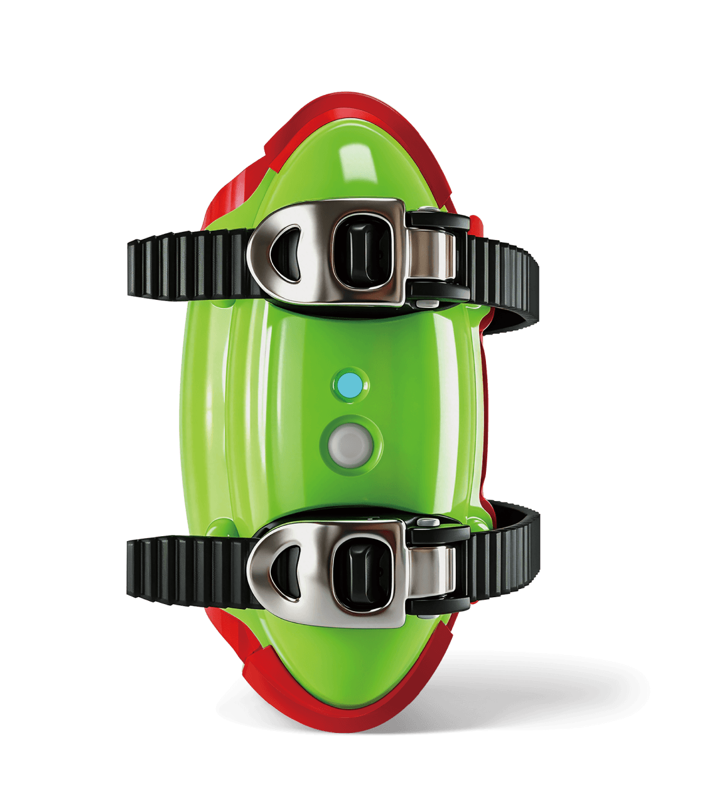
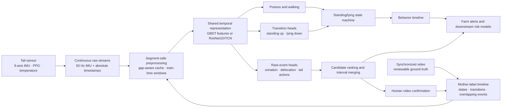

<div align="center">
  <a href="https://www.cowmata.com/en/">
    
  </a>

  <h1>COWMATA Tail-Sensor Intelligence</h1>

  <p><strong>Continuous cattle behavior and reproductive-event intelligence from tail-mounted multimodal sensing.</strong></p>
  <p>A research and engineering baseline for 50 Hz IMU processing, video-aligned annotation, cow-independent evaluation, event candidate mining, and production-oriented inference.</p>

  <p>
    <a href="https://github.com/zxq309/cowmata-tailring/actions/workflows/ci.yml"></a>
    <a href="https://github.com/zxq309/cowmata-tailring/releases/tag/v0.2.0"></a>
    
    
    
    
  </p>
</div>


> [!IMPORTANT]
> This repository is a validated algorithm-engineering baseline, not a standalone veterinary diagnostic product. Product-level claims require complete blinded ground truth, independent-cow evaluation, field validation, and the applicable regulatory review.

## Overview

Yangling Yuanshangyuan Intelligent Technology Co., Ltd., the company behind COWMATA, develops intelligent animal-health monitoring hardware and software. The official product portfolio includes tail sensors for estrus, pregnancy, calving, and health-risk monitoring. This repository contains the algorithm layer used to turn synchronized tail-mounted sensor streams and video-reviewed labels into reproducible behavior and event predictions.

The `20260818` baseline was rebuilt around a small set of durable engineering rules:

- preserve continuous raw sensing before choosing training windows;
- align sensor data and video labels on an absolute timeline;
- split training, validation, and test data by animal identity;
- report independent cows and independent events instead of inflated overlapping-window counts;
- combine temporal encoders, task-specific event heads, and a standing/lying state machine;
- use candidate mining and human video review to expand rare-event labels efficiently.

The public-facing repository layout is intentionally similar in spirit to mature ML projects such as Ultralytics: one Python API, one CLI, executable examples, model manifests, tests, CI, contribution rules, and versioned releases.

## Product context

The official [COWMATA website](https://www.cowmata.com/en/) describes an animal digital-brain and intelligent early-warning platform spanning intelligent hardware, multimodal sensing, AI algorithms, and livestock management. The images below are official COWMATA product assets stored locally in this repository so the README remains stable.

<table>
  <tr>
    <td align="center" width="50%">
      <br>
      <strong>Tail Sensor — Farm Edition</strong><br>
      <sub>Estrus, pregnancy, and calving monitoring context</sub>
    </td>
    <td align="center" width="50%">
      <br>
      <strong>Tail Sensor — Veterinary Edition</strong><br>
      <sub>Reproductive and animal-health monitoring context</sub>
    </td>
  </tr>
</table>

## System architecture



### Current task inventory

| Layer | Outputs | Current status |
|---|---|---|
| Persistent state | `STANDING`, `LYING`, `WALKING` | Supported by the data contract; standing/lying is stabilized by state logic |
| Posture transition | `STANDING_UP`, `LYING_DOWN` | Included in the deployable annotation-assistance model |
| Elimination event | `URINATION`, `DEFECATION` | Included; event-level validation remains the acceptance criterion |
| Tail action | `TAIL_RAISED`, `TAIL_WAGGING` | Research/rare-event candidate mining |
| Reproductive risk | estrus, pregnancy, calving | Product and data-collection roadmap; not claimed as validated by this repository baseline |
| Health feasibility | temperature, PPG, mastitis-related research | Multimodal research direction; no unsupported clinical claim |

## Model inventory

Model provenance, hashes, sizes, and intended use are recorded in [`weights/MANIFEST.json`](weights/MANIFEST.json).

| Artifact | Role | Status | Notes |
|---|---|---|---|
| `weights/deploy/gbdt_full.joblib` | Operational annotation assistance | Usable | 104 engineered features; eight dense outputs; source-to-refactor prediction parity verified |
| `weights/checkpoints/offline_tcn_dev_epoch2.pt` | Deep-model continuation and smoke testing | Development only | Loads and produces finite outputs, but does not have a completed formal model report |

The GBDT artifact is the default inference model. The TCN checkpoint must not be presented as a production model until its training run, independent-cow evaluation, thresholds, and deployment behavior are fully documented.

## Data contract

The machine-readable configuration is [`configs/dataset.yaml`](configs/dataset.yaml); the complete rules are in [`docs/DATA_CONTRACT.md`](docs/DATA_CONTRACT.md).

- Raw nine-axis IMU is sampled continuously at **50 Hz** and preserved before windowing.
- Cached `features.npy` arrays contain **13 channels**; continuity segments are defined by `metadata.json`.
- Windows are created during training/inference and may never cross a recorded data gap.
- Video and sensor records share an absolute time axis.
- Events retain start/end intervals and may overlap persistent states.
- Train/validation/test membership is separated by `cow_id`.
- Normalization, threshold selection, and early stopping may not inspect test cows.
- Reportable sample size is based on animals, independent events, and hard negatives—not sliding windows.

The compact Git-tracked annotation table retains a few original-language provenance fields alongside standardized English labels and event codes. Those provenance values are data, not user-interface copy, and are preserved intentionally.

## Quick start

### 1. Clone and create the environment

```bash
git clone https://github.com/zxq309/cowmata-tailring.git
cd cowmata-tailring
conda env create -f environment.yml
conda activate cowmata
```

Install the PyTorch build that matches the target machine from the [official PyTorch selector](https://pytorch.org/get-started/locally/), then install this project without replacing that build:

```bash
python -m pip install -e . --no-deps
```

### 2. Verify the clone

```bash
pytest
cowmata check-env --device cpu --precision fp32
```

### 3. Run the bundled 60-second demo

The demo does not require the private 1.29 GB supervised cache:

```bash
cowmata predict \
  --cache-key demo_session_60s \
  --data-root examples/demo_data \
  --out runs/demo
```

Expected behavior:

- 120 dense prediction points at 2 Hz;
- two CSV files under `runs/demo/`;
- zero or more merged event candidates depending on the configured threshold.

## Python API

```python
from cowmata import COWMATA

model = COWMATA("weights/deploy/gbdt_full.joblib")
result = model.predict(
    "<cache_key>",
    project="runs/predict",
    threshold=0.5,
)

print(result.dense.head())
print(result.candidates)
print(result.dense_path)
```

The model object loads once and can predict multiple cached sessions without reloading the serialized bundle.

## CLI workflow

```bash
# Validate session metadata, labels, cache contracts, and cow-level splits.
cowmata check-data

# Read every local cache array as a stronger integrity check.
cowmata check-data --full-cache-scan

# Write a structured dataset diagnostic report.
cowmata diagnose --out runs/diagnostics

# Check CPU or CUDA forward/backward execution.
cowmata check-env --device cpu --precision fp32
cowmata check-env --device cuda --precision auto

# Run selected reproducible pipeline stages.
cowmata pipeline -- --stages diagnose,features,feature_model
```

## Training and evaluation

### Feature model

```bash
python -m scripts.build_feature_table
python -m scripts.train_feature_model
```

### Full GBDT candidate model

```bash
python -m scripts.train_full_gbdt \
  --feature-table runs/feature_table/feature_table.parquet
```

### Deep leave-one-cow-out experiments

```bash
cowmata pipeline -- \
  --stages deep_loco \
  --epochs 30 \
  --batch-size 32 \
  --device cuda
```

Every experiment must record:

1. cow IDs in each split;
2. independent event counts and hard-negative counts;
3. preprocessing/window parameters;
4. model and threshold configuration;
5. event Precision/Recall/F1;
6. false alarms per cow per 24 hours;
7. temporal localization error;
8. for calving, the first correct alert lead time relative to the delivery anchor.

Window-level accuracy alone is not an acceptance metric.

## Repository layout

```text
.github/                    CI, issue templates, and pull-request template
assets/                     Official brand/product assets and repository visuals
cattle_imu/                 Stable algorithm core and serialized-model compatibility
cowmata/                    User-facing Python API and CLI
scripts/                    Data, training, diagnostics, evaluation, and mining entry points
configs/                    Machine-readable dataset configuration
datasets/cowmata_imu/       Small metadata + local Git-ignored supervised cache
examples/demo_data/         Clone-ready 60-second real-session demo
weights/deploy/             Usable annotation-assistance model
weights/checkpoints/        Development-only continuation checkpoints
runs/                       Generated experiments and predictions (Git ignored)
tests/                      Data, inference, and PyTorch contract tests
docs/                       Data, migration, verification, and reference documentation
```

## Data and repository boundaries

The following full-data artifacts remain local and are excluded by `.gitignore`:

- `datasets/cowmata_imu/supervised_cache/samples.csv` — approximately 60 MB;
- `datasets/cowmata_imu/supervised_cache/session_cache/` — approximately 1.23 GB across 132 sessions.

They are required for full retraining and real-data diagnostics. They are not obsolete cache waste. A fresh clone remains executable because the repository includes the demo session and both model artifacts. See [`docs/DATA_ACCESS.md`](docs/DATA_ACCESS.md) for versioned external delivery and integrity rules.

## Verified baseline

The 20260818 baseline has been checked locally and in GitHub Actions:

- **24/24 contract tests passed**;
- **132 supervised sessions** scanned, covering **131.5739 hours**;
- **344,287 supervised center points** verified;
- **six leave-one-cow-out manifests** checked for session overlap;
- refactored GBDT prediction parity: maximum absolute probability difference `1.11e-16`;
- bundled demo: **120 dense 2 Hz points** and successful CSV export;
- CPU PyTorch forward, backward, and optimizer smoke test passed.

See [`docs/VERIFICATION_20260818.md`](docs/VERIFICATION_20260818.md) for limitations and the exact evidence boundary.

## Reference radar

The following open-source projects are tracked for model design, benchmarking, and engineering practice. Repositories are references, not copied dependencies; license compatibility and cow-level reproduction are required before adoption. See [`docs/REFERENCE_PROJECTS.md`](docs/REFERENCE_PROJECTS.md) for the detailed watchlist.

1. [Time-Series-Library](https://github.com/thuml/Time-Series-Library) — unified benchmarking for forecasting, imputation, anomaly detection, and classification.
2. [tsai](https://github.com/timeseriesAI/tsai) — practical PyTorch/fastai models and workflows for time-series classification.
3. [aeon](https://github.com/aeon-toolkit/aeon) — actively maintained time-series machine-learning and deep-learning toolkit.
4. [sktime](https://github.com/sktime/sktime) — unified time-series framework with reproducible estimator conventions.
5. [tslearn](https://github.com/tslearn-team/tslearn) — classical time-series learning, similarity, and DTW-based methods.
6. [PyTorch-TCN](https://github.com/paul-krug/pytorch-tcn) — causal and non-causal temporal convolutional networks.
7. [MS-TCN](https://github.com/yabufarha/ms-tcn) — multi-stage temporal action segmentation.
8. [C2F-TCN](https://github.com/dipika-singhania/C2F-TCN) — coarse-to-fine temporal action segmentation.
9. [ASFormer](https://github.com/ChinaYi/ASFormer) — transformer-based temporal action segmentation.
10. [TS2Vec](https://github.com/zhihanyue/ts2vec) — universal contrastive time-series representation learning.
11. [TS-TCC](https://github.com/emadeldeen24/TS-TCC) — temporal and contextual contrastive representation learning.
12. [OxWearables](https://github.com/OxWearables/ssl-wearables) — self-supervised wearable accelerometer learning.
13. [Orion](https://github.com/sintel-dev/Orion) — unsupervised anomaly-detection pipelines for rare temporal patterns.
14. [TAB](https://github.com/decisionintelligence/TAB) — benchmarking framework for time-series anomaly detection.
15. [DVC](https://github.com/iterative/dvc) — dataset and model versioning without committing large arrays to Git.
16. [MLflow](https://github.com/mlflow/mlflow) — experiment, model, and artifact tracking.

## Roadmap

- complete formal independent-cow reporting for the current deep checkpoint;
- improve event candidate ranking with reviewed hard negatives;
- compare TCN/ResNet1D baselines with modern classification and representation-learning models;
- add calving onset/delivery anchors and multi-horizon risk labels;
- introduce PPG and temperature quality gates before multimodal fusion;
- add a versioned private data registry with archive hashes and access control;
- export deployment candidates to a stable interchange format only after parity testing.

## Team

<p align="center">
  <a href="https://www.cowmata.com/">
    
  </a>
</p>

- **Xiangqing Zhang** — Chief Technology Officer, Yangling Yuanshangyuan Intelligent Technology Co., Ltd.; Yan'an University
- **Yalong Zhang** — Founder, Yangling Yuanshangyuan Intelligent Technology Co., Ltd.
- **Tengyu Jiao** — Yan'an University
- **Yachen Zhao** — Yan'an University

The project is developed by the COWMATA algorithm team. Personal GitHub accounts should be credited through their own verified commits; contribution history is never fabricated.

## Changelog

- **2026-08-18** — Added the official company logo, credited four named contributors with institutional affiliations, and numbered the external reference radar. See [`CHANGELOG.md`](CHANGELOG.md) for the complete history.

## Responsible use and license

Copyright © 2026 Yangling Yuanshangyuan Intelligent Technology Co., Ltd. All rights reserved.

This repository currently has no public-use license. Source code, model artifacts, product imagery, and project data remain proprietary unless the company publishes separate terms. Third-party software remains governed by its own license. See [`NOTICE`](NOTICE) and [`SECURITY.md`](SECURITY.md).

For company and product information, visit [cowmata.com](https://www.cowmata.com/en/).
