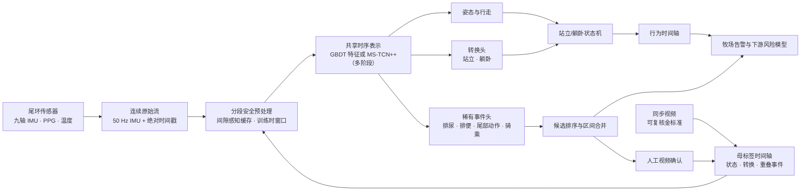
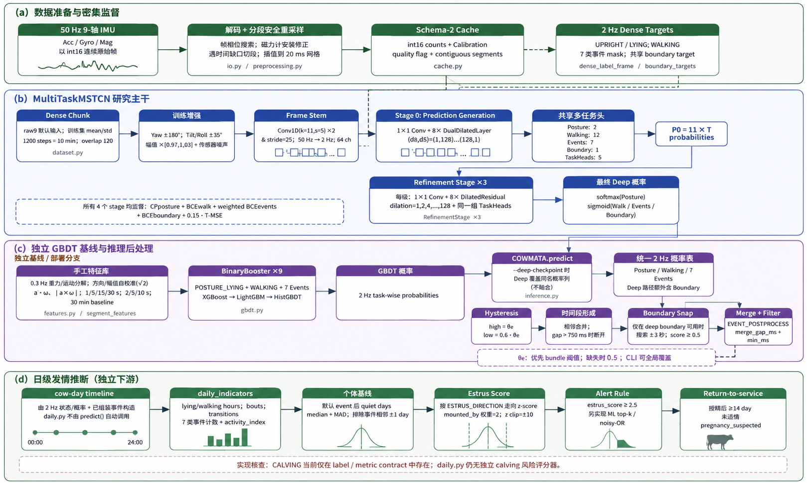

<div align="center">
  <a href="https://www.cowmata.com/">
    
  </a>

  <h1>COWMATA 尾环传感器智能</h1>

  <p><strong>基于尾端多模态传感的奶牛行为与繁殖事件连续智能分析。</strong></p>
  <p>面向 50 Hz IMU 处理、视频对齐标注、跨奶牛独立评估、事件候选挖掘与生产级推理的研究与工程基线。</p>

  <p>
    <a href="https://github.com/zxq309/cowmata-tailring/actions/workflows/ci.yml"></a>
    <a href="https://github.com/zxq309/cowmata-tailring/releases/tag/v0.3.1"></a>
    
    
    
    
  </p>
</div>

[English](README.md) | [简体中文](README.zh-CN.md)


> [!IMPORTANT]
> 本仓库是一个经过验证的算法工程基线，而非独立的兽医诊断产品。产品级结论需具备完整的盲法金标准、跨奶牛独立评估、现场验证及适用的监管审查。

## 更新记录

- **2026-08-18** — 首次真实数据训练：MS-TCN++ 8 折严格 LOCO + GBDT 合规重训。按牛结果与 bootstrap 区间见双语[实验报告](docs/EXPERIMENTS_20260819.zh-CN.md)（[English](docs/EXPERIMENTS_20260819.md)）。
- **2026-08-19** — 发布 v0.3.0：MS-TCN++ 多阶段时序模型（ASRF 式边界头）；schema-2 int16 缓存（52 → 18 字节/帧）；新增 `MOUNTING` / `MOUNTED_BY` 事件头；迟滞后处理；逐事件阈值写入模型包；torch 变为可选依赖；完整监督缓存以百度网盘链接发布（见[数据集](#数据集)一节）。完整历史见 [`CHANGELOG.md`](CHANGELOG.md)。
- **2026-08-18** — 新增公司官方 logo、署名四位实名贡献者及其单位，并为外部参考雷达添加序号。

## 概述

COWMATA 背后的杨凌园上园智能科技有限公司（Yangling Yuanshangyuan Intelligent Technology Co., Ltd.）研发智能动物健康监测软硬件。官方产品线涵盖用于发情、妊娠、产犊与健康风险监测的尾环传感器。本仓库包含算法层，用于将时间同步的尾端传感数据流与视频复核标签转化为可复现的行为与事件预测。

`20260819` 基线围绕一组稳定的工程规则构建：

- 在选择训练窗口前保留连续原始传感数据；
- 在绝对时间轴上对齐传感器数据与视频标签；
- 以稠密分块监督训练——每个窗口步长一个标签帧，而非每个标签点一个窗口；
- 按动物个体划分训练、验证与测试集；
- 结合多阶段时序模型（MS-TCN++）、任务专用事件头与站立/躺卧状态机；
- 以迟滞与边界吸附做后处理，再挖掘候选供人工视频复核，高效扩充稀有事件标签；
- 以独立奶牛与独立事件计数报告，而非膨胀的滑动窗口计数。

## 三个任务，三个时间尺度

正确命名任务，才能找到正确的文献与库。

| | 输入 | 输出 | 尺度 | 领域 |
|---|---|---|---|---|
| **A. 姿态 / 运动** | 连续 50 Hz 流 | 每一时刻的状态 | 秒 | 时序分割 |
| **B. 七类事件** | 连续 50 Hz 流 | 区间 `(起, 止, 类别)` | 秒至 30 秒 | 时序动作检测 |
| **C. 发情 / 产犊** | A + B 按小时与天聚合 | 风险与告警 | 天 | 变点 / 风险预测 |

这不是时序分类（UCR/UEA 风格、基于预切序列），也不是预测。只有 C 层接近预测。

## 快速开始

### 1. 克隆并创建环境

```bash
git clone https://github.com/zxq309/cowmata-tailring.git
cd cowmata-tailring
conda env create -f environment.yml
conda activate cowmata
```

从 [PyTorch 官方选择器](https://pytorch.org/get-started/locally/) 安装与目标机器匹配的 PyTorch 构建，然后在不替换该构建的前提下安装本项目：

```bash
python -m pip install -e . --no-deps
# 深度学习主机额外安装：
python -m pip install -e ".[deep]"
```

### 2. 验证克隆

```bash
pytest tests/test_contracts.py tests/test_pipelines.py   # 48 个测试，无需 torch
cowmata check-env --device cpu                            # 无 torch 也可运行
pytest tests/test_torch_contracts.py                      # 模型契约，需要 torch
```

### 3. 运行内置 60 秒演示

演示无需私有 1.29 GB 监督缓存：

```bash
cowmata predict \
  --cache-key demo_session_60s \
  --data-root examples/demo_data \
  --out runs/demo
```

预期行为：

- 2 Hz 下 120 个稠密预测点；
- `runs/demo/` 下两个 CSV 文件；
- 取决于配置阈值的零个或多个合并事件候选。

## Python API

```python
from cowmata import COWMATA

model = COWMATA("weights/deploy/gbdt_full.joblib")
result = model.predict(
    "<cache_key>",
    project="runs/predict",
    threshold=0.5,
)

print(result.dense.head())
print(result.candidates)
print(result.dense_path)
```

模型对象加载一次，即可对多个缓存会话进行预测，而无需重新加载序列化包。

## CLI 工作流

```bash
# 校验会话元数据、标签、缓存契约与奶牛级划分。
cowmata check-data --root .

# 读取每个本地缓存数组作为更强的完整性检查。
cowmata check-data --full-cache-scan

# 写出结构化数据集诊断报告。
cowmata diagnose --out runs/diagnostics

# 采集前估算缓存占用。
cowmata plan-storage --cows 200 --days 7

# 奶牛分组 k 折划分，验证集与训练集奶牛不相交。
cowmata make-splits --folds 5

# 从原始 JSON + 标签重建 schema-2 缓存。
cowmata build-cache --annotations ... --calibration-manifest ... --output-root ...

# 手工特征表（离线或因果窗口）。
cowmata build-features --samples ... --session-cache ... --out ... --offline

# 在奶牛不相交划分上训练 GBDT 并写入逐事件阈值。
cowmata train-gbdt --feature-table ... --backend xgboost --device cuda

# 在一个折上训练多阶段时序模型。
cowmata train --labels ... --cache-root ... --splits ... --fold 1 --out runs/fold1

# 从稠密预测构建人工复核队列。
cowmata mine --predictions runs/... --events URINATION,MOUNTED_BY --out runs/review_01

# 检查 CPU 或 CUDA 执行。
cowmata check-env --device cpu --precision fp32
```

## 产品背景

官方 [COWMATA 官网](https://www.cowmata.com/en/) 描述了覆盖智能硬件、多模态传感、AI 算法与畜牧管理的动物数字大脑与智能预警平台。

<table>
  <tr>
    <td align="center" width="50%">
      <br>
      <strong>尾环传感器 — 牧场版</strong><br>
      <sub>发情、妊娠与产犊监测场景</sub>
    </td>
    <td align="center" width="50%">
      <br>
      <strong>尾环传感器 — 兽医版</strong><br>
      <sub>繁殖与动物健康监测场景</sub>
    </td>
  </tr>
</table>

## 系统架构



总体框架如下图所示：



### 当前任务清单

| 层 | 输出 | 当前状态 |
|---|---|---|
| 持续状态 | `STANDING`、`LYING`、`WALKING` | 由数据契约支持；站立/躺卧由状态逻辑稳定 |
| 姿态转换 | `STANDING_UP`、`LYING_DOWN` | 已纳入可部署的标注辅助模型 |
| 排泄事件 | `URINATION`、`DEFECATION` | 已纳入；事件级验证仍为验收标准 |
| 骑乘事件 | `MOUNTING`、`MOUNTED_BY` | 20260819 新增；被骑乘是发情的兽医金标准 |
| 尾部动作 | `TAIL_RAISED` | 已纳入；`TAIL_WAGGING` 已弃用（可读、不训练、不报告） |
| 繁殖风险 | 发情、妊娠、产犊 | 产品与数据采集路线图；不作为本仓库基线已验证内容 |
| 健康可行性 | 温度、PPG、乳腺炎相关研究 | 多模态研究方向；无未经验证的临床结论 |

## 模型清单

模型来源、哈希、大小与预期用途记录于 [`weights/MANIFEST.json`](weights/MANIFEST.json)。

| 产物 | 角色 | 状态 | 备注 |
|---|---|---|---|
| `weights/deploy/gbdt_full.joblib` | 运营标注辅助 | 可用 | `feature_version=1` 下 104 个工程特征；与已验证的 20260818 产物字节一致。其早于逐事件阈值机制，以 feature_version 1 与 0.5 阈值打分。本地已有带奶牛不相交阈值的 v2 特征重训产物，尚未晋升——见[实验报告](docs/EXPERIMENTS_20260819.zh-CN.md) |
| `weights/checkpoints/offline_tcn_dev_epoch2.pt` | 仅存证 | 20260819 无法加载 | 20260819 模型为 `MultiTaskMSTCN`，架构与标签集均不同，此检查点不可加载或续训。它从未是可部署模型 |

GBDT 产物为默认推理模型。TCN 检查点不得作为生产模型呈现；其替代者（MS-TCN++）通过 `cowmata train` 训练，并按标准跨奶牛独立协议报告。

## 数据契约

机器可读配置为 [`configs/dataset.yaml`](configs/dataset.yaml)；完整规则见 [`docs/DATA_CONTRACT.md`](docs/DATA_CONTRACT.md)。

- 原始九轴 IMU 以 **50 Hz** 连续采样，并在加窗前保留。
- schema-2 缓存存储 `signal.i16.npy`——`(N, 9)` **int16 设备计数值**——以及 `meta.json`（标定除数/偏置、连续性分段、稀疏质量区间与 `tail_position`）。每帧 18 字节；20260818 的 schema-1 `features.npy`（13 个 float32 通道）通过同一 API 透明读取。
- 窗口在训练/推理期间创建，且不得跨越已记录的数据间隙。
- 视频与传感器记录共享同一绝对时间轴。
- 事件保留起止区间，并可与持续状态重叠；20260819 新增 `MOUNTING` / `MOUNTED_BY`，弃用 `TAIL_WAGGING`。
- 训练/验证/测试归属按 `cow_id` 分离。
- 归一化、阈值选择与早停不得查看测试奶牛。
- 可报告样本量基于动物数、独立事件与硬负样本——而非滑动窗口。

## 训练与评估

特征与 GBDT 分支：

```bash
cowmata build-cache --annotations ... --calibration-manifest ... --output-root ...
cowmata build-features --samples ... --session-cache ... --out runs/feature_table --offline
cowmata train-gbdt --feature-table runs/feature_table/feature_table.parquet --backend xgboost --device cuda
```

深度多阶段时序模型（MS-TCN++），按奶牛分折：

```bash
cowmata make-splits --folds 5
cowmata train --labels ... --cache-root ... --splits ... --fold 1 --out runs/fold1 --device cuda
cowmata mine --predictions runs/... --events URINATION,MOUNTED_BY --out runs/review_01
```

每个实验必须记录：

1. 各划分中的 cow ID；
2. 独立事件计数与硬负样本计数；
3. 预处理/窗口参数；
4. 模型与阈值配置；
5. 事件 Precision/Recall/F1；
6. 每牛每 24 小时误报数；
7. 时间定位误差；
8. 对产犊而言，相对分娩锚点的首个正确告警提前时间。

仅窗口级准确率不作为验收指标。

## 仓库结构

```text
.github/                    CI、issue 模板与 pull-request 模板
assets/                     官方品牌/产品素材与仓库视觉资源
cowmata/                    单一包：io、cache、preprocessing、features、labels、
                            models、dataset、train、metrics、postprocess、daily、
                            inference、gbdt、tools、runtime、cli、compat
scripts/                    cowmata.cli 的四行薄封装（兼容旧模块路径）
experiments/                已尝试未采用（晚期融合）
configs/                    机器可读数据集配置
datasets/cowmata_imu/       小型元数据 + 本地 Git 忽略的监督缓存
examples/demo_data/         可直接克隆的 60 秒真实会话演示
weights/deploy/             可用标注辅助模型
weights/checkpoints/        仅存证用开发检查点
runs/                       生成的实验与预测（Git 忽略）
tests/                      数据、流水线与 PyTorch 契约测试
docs/                       数据、迁移、验证与参考文档
```

## 数据集

完整监督缓存不进入 Git：体量超出普通 Git 的适用范围，且包含公司、设备与动物标识。它以两个百度网盘归档分发；新克隆所需的其余内容随仓库提供。

| 产物 | 内容 | 大小 | 分发方式 |
|---|---|---|---|
| `supervised_cache/session_cache/` | 132 个连续 50 Hz 会话——schema-2 `signal.i16.npy`（9 通道 int16 计数值）+ `meta.json`（标定、分段、`tail_position`） | ≈ 1.4 GB | [百度网盘 · session_cache](https://pan.baidu.com/s/1lnLpqO_UX5S57zmI1Qf_qw?pwd=u9n4)（提取码 `u9n4`） |
| `supervised_cache/samples.csv` | 351,128 个监督中心点——牛 / 会话 / 分段坐标与逐事件掩码 | ≈ 59 MB | [百度网盘 · samples.csv](https://pan.baidu.com/s/12mj-bflbcekc1x1_HI2NeQ?pwd=s5rd)（提取码 `s5rd`） |
| `supervised_cache/sessions.csv`、`dense_labels.csv.gz` | 会话元数据与 GBDT/深度分支共享的稠密标签帧 | ≈ 7 MB | 随仓库提供 |
| `annotations/`、`loco_splits/`、`development_split/` | 仲裁后标注与奶牛级划分清单 | 小 | 随仓库提供 |
| `examples/demo_data/…/demo_session_60s/` | 60 秒真实会话（schema 1），供克隆后冒烟测试 | ≈ 0.2 MB | 随仓库提供 |

恢复完整缓存：将两个归档解压到 `datasets/cowmata_imu/supervised_cache/`，然后运行：

```bash
cowmata check-data --full-cache-scan
```

这些产物是完整重训练与真实数据诊断所必需的，并非过时缓存垃圾。交付与完整性规则见 [`docs/DATA_ACCESS.md`](docs/DATA_ACCESS.md)。

## 已验证基线

20260819 基线的验证记录见 [`docs/VERIFICATION_20260819.md`](docs/VERIFICATION_20260819.md)；CI 在每次推送时重跑契约套件：

- **36/36 契约测试**与 **12/12 流水线测试**通过，真实执行；
- `cowmata check-data` — PASS：1,199 条标注、132 个会话、0 个问题；
- 存储规划：200 牛 × 7 天，292.9 GB（schema 1）→ **101.4 GB**（schema 2）；
- `FEATURE_VERSION=1` 按序复现已部署的 104 个特征名（对照 pickle 字节流验证）；
- 内置演示：**120 个 2 Hz 稠密点**，与 20260818 记录行为一致；
- 迟滞组装：1 秒概率凹陷判为 **1 个区间**（旧单阈值规则判 2 个）；
- 模型包回环：训练写出的逐事件阈值与 `feature_version` 在推理时原样生效；
- 无 torch 主机上 `cowmata check-env` 正常完成。

如实说明：该验证记录早于首次训练运行，不包含任何真实数据指标。首次训练运行及其证据状态见[实验结果](#实验结果)。

## 实验结果

首次真实数据训练，2026-08-18；完整双语报告：[docs/EXPERIMENTS_20260819.zh-CN.md](docs/EXPERIMENTS_20260819.zh-CN.md)（[English](docs/EXPERIMENTS_20260819.md)）。

**MS-TCN++ 8 折严格 LOCO**（单卡 RTX 3090 用时 40.5 分钟）。8 头测试牛的池化评估（约 33.4 万个评估点、约 47 个标注小时；官方指标函数，每个事件统一使用该事件各折阈值的中位数）：

| 任务头 | 总体指标 | 值 | 事件：真 / 预测 / 命中 |
|---|---|---|---|
| 姿态（站/卧） | 准确率（MoF）· macro-F1 | **0.596** · 0.374 | — |
| 行走 WALKING | 平均精度 | **0.532** | — |
| 起立 STANDING_UP | recall@2.5s · F1@25 · AP | 0.478 · 0.188 · 0.255 | 115 / 459 / 55 |
| 卧下 LYING_DOWN | recall@2.5s · F1@25 · AP | 0.381 · 0.176 · 0.203 | 97 / 301 / 37 |
| 排尿 URINATION | recall@2.5s · F1@25 · AP | 0.664 · 0.132 · 0.202 | 116 / 977 / 77 |
| 排便 DEFECATION | recall@2.5s · F1@25 · AP | 0.780 · 0.073 · 0.048 | 50 / 992 / 39 |
| 抬尾 TAIL_RAISED | recall@2.5s · F1@25 · AP | 0.625 · 0.033 · 0.314 | 32 / 1127 / 20 |
| MOUNTING / MOUNTED_BY | not_evaluable（标注 0 个正样本） | — | — |
| **selection_score**（唯一模型选择目标） | | **0.387** | |

怎么读这张表：

- 这里故意不给"事件准确率"：事件极稀疏，全预测"无事件"点级准确率就有 99%+，指标契约禁止单独引用它。上面的姿态行是真实的帧级准确率（MoF）；事件统一用 recall、F1@25 与平均精度报告。
- 模型找得到事件（recall 0.38–0.78），但五个事件头合计约 9:1 过度预测（410 个真区间对 3,856 个预测区间）——事件 F1@25 因此只有 0.03–0.19。
- 按牛差异仍然很大（test selection score 0.35–0.64，bootstrap 区间 [0.470, 0.597]）；事件 precision 与误报率在 `review_coverage` 补齐前**不可引用**，上表的命中比例仅来自带标签片段。

### 按牛排名（每头牛 = 自己的 LOCO 留出结果，官方 selection_score）

| 排名 | 测试牛 | selection_score | 姿态准确率 | 行走 AP | 5 事件 AP |
|---|---|---|---|---|---|
| 1 | 23489-8 | 0.642 | 1.0* | n/e | 0.99–1.00 |
| 2 | 21100-10 | 0.636 | 1.0* | 0.988 | 0.09–0.59 |
| 3 | **23335-7** | **0.627** | 1.0* | n/e | **0.86–0.99** |
| 4 | 23509-9 | 0.553 | 0.843 | 0.928 | 0.02–0.34 |
| 5 | 23381-w1 | 0.526 | 1.0* | n/e | 0.44–0.77 |
| 6 | 24178-11 | 0.508 | 1.0* | n/e | 0.47–0.64 |
| 7 | 20201-3 | 0.461 | 0.650 | 0.819 | 0.05–0.16 |
| 8 | 21074-1 | 0.352 | 0.566 | 0.529 | 0.01–0.11 |

`*` = 退化值（测试集只有单一姿态类），`n/e` = 不可评估（无该类正样本）。名义第一
23489-8 仅建立在 13 个事件上（每类 1–4 个），AP≈1.00 统计上很脆；最可信的最好
结果是 **23335-7**——起立 / 排尿 / 排便的 F1@25 分别达到 0.93 / 0.94 / 0.82，基于
28.8 万个测试点与 82 个真事件（完整按任务明细见报告）。

**GBDT 重训** — 全量 351,127 行 × 120 特征（v2）特征表，xgboost GPU，奶牛不相交验证（23381-w1、23509-9），逐事件阈值写入 bundle。产物留在本地（`runs/gbdt_full/`），待复核证据就绪后再晋升 `weights/deploy/`。

## 参考雷达

以下开源项目用于模型设计、基准测试与工程实践跟踪。这些仓库是参考而非复制的依赖；采用前须满足许可兼容与奶牛级可复现性。详见 [`docs/REFERENCE_PROJECTS.md`](docs/REFERENCE_PROJECTS.md) 详细观察清单。

1. [Time-Series-Library](https://github.com/thuml/Time-Series-Library) — 面向预测、插补、异常检测与分类的统一基准测试。
2. [tsai](https://github.com/timeseriesAI/tsai) — 面向时序分类的实用 PyTorch/fastai 模型与工作流。
3. [aeon](https://github.com/aeon-toolkit/aeon) — 活跃维护的时序机器学习与深度学习工具包。
4. [sktime](https://github.com/sktime/sktime) — 具有可复现估计器约定的统一时序框架。
5. [tslearn](https://github.com/tslearn-team/tslearn) — 经典时序学习、相似度与 DTW 方法。
6. [PyTorch-TCN](https://github.com/paul-krug/pytorch-tcn) — 因果与非因果时序卷积网络。
7. [MS-TCN](https://github.com/yabufarha/ms-tcn) — 多阶段时序动作分割。
8. [C2F-TCN](https://github.com/dipika-singhania/C2F-TCN) — 由粗到细的时序动作分割。
9. [ASFormer](https://github.com/ChinaYi/ASFormer) — 基于 Transformer 的时序动作分割。
10. [TS2Vec](https://github.com/zhihanyue/ts2vec) — 通用对比时序表示学习。
11. [TS-TCC](https://github.com/emadeldeen24/TS-TCC) — 时序与上下文对比表示学习。
12. [OxWearables](https://github.com/OxWearables/ssl-wearables) — 自监督可穿戴加速度计学习。
13. [Orion](https://github.com/sintel-dev/Orion) — 面向稀有时序模式的无监督异常检测流水线。
14. [TAB](https://github.com/decisionintelligence/TAB) — 时序异常检测基准测试框架。
15. [DVC](https://github.com/iterative/dvc) — 无需将大数组提交到 Git 的数据集与模型版本化。
16. [MLflow](https://github.com/mlflow/mlflow) — 实验、模型与产物跟踪。

## 路线图

- 为 MS-TCN++ 模型完成正式的跨奶牛独立报告；
- 利用复核硬负样本改进事件候选排序；
- 将 MS-TCN++ 与现代分类及表示学习模型对比；
- 增加产犊开始/分娩锚点与多时域风险标签；
- 在多模态融合前引入 PPG 与温度质量门控；
- 增加带归档哈希与访问控制的版本化私有数据注册表；
- 仅在一致性测试通过后，将部署候选导出为稳定的交换格式。

## 团队

<p align="center">
  <a href="https://www.cowmata.com/">
    
  </a>
</p>

- **张向清** — 杨凌园上园智能科技有限公司首席技术官；延安大学
- **张亚龙** — 杨凌园上园智能科技有限公司创始人
- **焦腾宇** — 延安大学
- **赵雅晨** — 延安大学

本项目由 COWMATA 算法团队开发。

## 引用

如本基线对您的工作有所帮助，请引用本仓库及确切的发布标签：

```bibtex
@software{cowmata_tailring,
  title = {COWMATA Tail-Sensor Intelligence},
  author = {Zhang, Xiangqing and Zhang, Yalong and Jiao, Tengyu and Zhao, Yachen},
  year = {2026},
  url = {https://github.com/zxq309/cowmata-tailring}
}
```

机器可读的引用元数据见 [`CITATION.cff`](CITATION.cff)。

## 贡献

欢迎贡献与问题报告。工作流见 [`CONTRIBUTING.md`](CONTRIBUTING.md)，安全问题报告见 [`SECURITY.md`](SECURITY.md)。

## 负责任使用与许可

版权所有 © 2026 杨凌园上园智能科技有限公司。保留所有权利。

本仓库当前无公开使用许可。源代码、模型产物、产品图片与项目数据在公司发布单独条款前均为专有。第三方软件仍受其自身许可约束。见 [`NOTICE`](NOTICE) 与 [`SECURITY.md`](SECURITY.md)。

公司及产品信息见 [cowmata.com](https://www.cowmata.com/en/)；咨询见 [联系页面](https://www.cowmata.com/contact/)。
