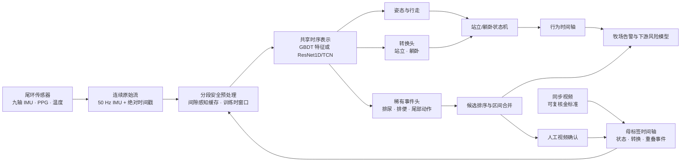

<div align="center">
  <a href="https://www.cowmata.com/">
    
  </a>

  <h1>COWMATA 尾环传感器智能</h1>

  <p><strong>基于尾端多模态传感的奶牛行为与繁殖事件连续智能分析。</strong></p>
  <p>面向 50 Hz IMU 处理、视频对齐标注、跨奶牛独立评估、事件候选挖掘与生产级推理的研究与工程基线。</p>

  <p>
    <a href="https://github.com/zxq309/cowmata-tailring/actions/workflows/ci.yml"></a>
    <a href="https://github.com/zxq309/cowmata-tailring/releases/tag/v0.2.0"></a>
    
    
    
    
  </p>
</div>

[English](README.md) | [简体中文](README.zh-CN.md)


> [!IMPORTANT]
> 本仓库是一个经过验证的算法工程基线，而非独立的兽医诊断产品。产品级结论需具备完整的盲法金标准、跨奶牛独立评估、现场验证及适用的监管审查。

## 更新记录

- **2026-08-18** — 新增公司官方 logo、署名四位实名贡献者及其单位，并为外部参考雷达添加序号。完整历史见 [`CHANGELOG.md`](CHANGELOG.md)。

## 概述

COWMATA 背后的杨凌园上园智能科技有限公司（Yangling Yuanshangyuan Intelligent Technology Co., Ltd.）研发智能动物健康监测软硬件。官方产品线涵盖用于发情、妊娠、产犊与健康风险监测的尾环传感器。本仓库包含算法层，用于将时间同步的尾端传感数据流与视频复核标签转化为可复现的行为与事件预测。

`20260818` 基线围绕一组稳定的工程规则重建：

- 在选择训练窗口前保留连续原始传感数据；
- 在绝对时间轴上对齐传感器数据与视频标签；
- 按动物个体划分训练、验证与测试集；
- 以独立奶牛与独立事件计数报告，而非膨胀的滑动窗口计数；
- 结合时序编码器、任务专用事件头与站立/躺卧状态机；
- 利用候选挖掘与人工视频复核高效扩充稀有事件标签。

本仓库对外布局有意对标 Ultralytics 等成熟 ML 项目：一套 Python API、一个 CLI、可执行示例、模型清单、测试、CI、贡献规范与版本化发布。

## 产品背景

官方 [COWMATA 官网](https://www.cowmata.com/en/) 描述了覆盖智能硬件、多模态传感、AI 算法与畜牧管理的动物数字大脑与智能预警平台。下方图片为官方 COWMATA 产品素材，已本地化存储于本仓库以保证 README 稳定。

<table>
  <tr>
    <td align="center" width="50%">
      <br>
      <strong>尾环传感器 — 牧场版</strong><br>
      <sub>发情、妊娠与产犊监测场景</sub>
    </td>
    <td align="center" width="50%">
      <br>
      <strong>尾环传感器 — 兽医版</strong><br>
      <sub>繁殖与动物健康监测场景</sub>
    </td>
  </tr>
</table>

## 系统架构



### 当前任务清单

| 层 | 输出 | 当前状态 |
|---|---|---|
| 持续状态 | `STANDING`、`LYING`、`WALKING` | 由数据契约支持；站立/躺卧由状态逻辑稳定 |
| 姿态转换 | `STANDING_UP`、`LYING_DOWN` | 已纳入可部署的标注辅助模型 |
| 排泄事件 | `URINATION`、`DEFECATION` | 已纳入；事件级验证仍为验收标准 |
| 尾部动作 | `TAIL_RAISED`、`TAIL_WAGGING` | 研究/稀有事件候选挖掘 |
| 繁殖风险 | 发情、妊娠、产犊 | 产品与数据采集路线图；不作为本仓库基线已验证内容 |
| 健康可行性 | 温度、PPG、乳腺炎相关研究 | 多模态研究方向；无未经验证的临床结论 |

## 模型清单

模型来源、哈希、大小与预期用途记录于 [`weights/MANIFEST.json`](weights/MANIFEST.json)。

| 产物 | 角色 | 状态 | 备注 |
|---|---|---|---|
| `weights/deploy/gbdt_full.joblib` | 运营标注辅助 | 可用 | 104 个工程特征；八个稠密输出；已验证重构前后预测一致 |
| `weights/checkpoints/offline_tcn_dev_epoch2.pt` | 深度模型续训与冒烟测试 | 仅开发 | 可加载并产出有限输出，但尚未完成正式模型报告 |

GBDT 产物为默认推理模型。在训练运行、跨奶牛独立评估、阈值与部署行为完整记录之前，TCN 检查点不得作为生产模型呈现。

## 数据契约

机器可读配置为 [`configs/dataset.yaml`](configs/dataset.yaml)；完整规则见 [`docs/DATA_CONTRACT.md`](docs/DATA_CONTRACT.md)。

- 原始九轴 IMU 以 **50 Hz** 连续采样，并在加窗前保留。
- 缓存的 `features.npy` 数组包含 **13 个通道**；连续性分段由 `metadata.json` 定义。
- 窗口在训练/推理期间创建，且不得跨越已记录的数据间隙。
- 视频与传感器记录共享同一绝对时间轴。
- 事件保留起止区间，并可与持续状态重叠。
- 训练/验证/测试归属按 `cow_id` 分离。
- 归一化、阈值选择与早停不得查看测试奶牛。
- 可报告样本量基于动物数、独立事件与硬负样本——而非滑动窗口。

Git 跟踪的紧凑标注表在标准化英文标签与事件码之外保留了少量原始语言溯源字段。这些溯源值是数据而非界面文案，有意保留。

## 快速开始

### 1. 克隆并创建环境

```bash
git clone https://github.com/zxq309/cowmata-tailring.git
cd cowmata-tailring
conda env create -f environment.yml
conda activate cowmata
```

从 [PyTorch 官方选择器](https://pytorch.org/get-started/locally/) 安装与目标机器匹配的 PyTorch 构建，然后在不替换该构建的前提下安装本项目：

```bash
python -m pip install -e . --no-deps
```

### 2. 验证克隆

```bash
pytest
cowmata check-env --device cpu --precision fp32
```

### 3. 运行内置 60 秒演示

演示无需私有 1.29 GB 监督缓存：

```bash
cowmata predict \
  --cache-key demo_session_60s \
  --data-root examples/demo_data \
  --out runs/demo
```

预期行为：

- 2 Hz 下 120 个稠密预测点；
- `runs/demo/` 下两个 CSV 文件；
- 取决于配置阈值的零个或多个合并事件候选。

## Python API

```python
from cowmata import COWMATA

model = COWMATA("weights/deploy/gbdt_full.joblib")
result = model.predict(
    "<cache_key>",
    project="runs/predict",
    threshold=0.5,
)

print(result.dense.head())
print(result.candidates)
print(result.dense_path)
```

模型对象加载一次，即可对多个缓存会话进行预测，而无需重新加载序列化包。

## CLI 工作流

```bash
# 校验会话元数据、标签、缓存契约与奶牛级划分。
cowmata check-data

# 读取每个本地缓存数组作为更强的完整性检查。
cowmata check-data --full-cache-scan

# 写出结构化数据集诊断报告。
cowmata diagnose --out runs/diagnostics

# 检查 CPU 或 CUDA 前向/反向执行。
cowmata check-env --device cpu --precision fp32
cowmata check-env --device cuda --precision auto

# 运行选定的可复现流水线阶段。
cowmata pipeline -- --stages diagnose,features,feature_model
```

## 训练与评估

### 特征模型

```bash
python -m scripts.build_feature_table
python -m scripts.train_feature_model
```

### 完整 GBDT 候选模型

```bash
python -m scripts.train_full_gbdt \
  --feature-table runs/feature_table/feature_table.parquet
```

### 深度留一牛（leave-one-cow-out）实验

```bash
cowmata pipeline -- \
  --stages deep_loco \
  --epochs 30 \
  --batch-size 32 \
  --device cuda
```

每个实验必须记录：

1. 各划分中的 cow ID；
2. 独立事件计数与硬负样本计数；
3. 预处理/窗口参数；
4. 模型与阈值配置；
5. 事件 Precision/Recall/F1；
6. 每牛每 24 小时误报数；
7. 时间定位误差；
8. 对产犊而言，相对分娩锚点的首个正确告警提前时间。

仅窗口级准确率不作为验收指标。

## 仓库结构

```text
.github/                    CI、issue 模板与 pull-request 模板
assets/                     官方品牌/产品素材与仓库视觉资源
cattle_imu/                 稳定算法核心与序列化模型兼容层
cowmata/                    面向用户的 Python API 与 CLI
scripts/                    数据、训练、诊断、评估与挖掘入口
configs/                    机器可读数据集配置
datasets/cowmata_imu/       小型元数据 + 本地 Git 忽略的监督缓存
examples/demo_data/         可直接克隆的 60 秒真实会话演示
weights/deploy/             可用标注辅助模型
weights/checkpoints/        仅开发用续训检查点
runs/                       生成的实验与预测（Git 忽略）
tests/                      数据、推理与 PyTorch 契约测试
docs/                       数据、迁移、验证与参考文档
```

## 数据与仓库边界

以下全量数据产物保留在本地，并由 `.gitignore` 排除：

- `datasets/cowmata_imu/supervised_cache/samples.csv` — 约 60 MB；
- `datasets/cowmata_imu/supervised_cache/session_cache/` — 约 1.23 GB，共 132 个会话。

它们是完整重训练与真实数据诊断所必需的，并非过时缓存垃圾。新克隆仍可执行，因为仓库包含演示会话与两个模型产物。版本化外部交付与完整性规则见 [`docs/DATA_ACCESS.md`](docs/DATA_ACCESS.md)。

## 已验证基线

20260818 基线已在本地与 GitHub Actions 中检查：

- **24/24 契约测试通过**；
- **132 个监督会话**已扫描，覆盖 **131.5739 小时**；
- **344,287 个监督中心点**已验证；
- **六个留一牛清单**已检查会话重叠；
- 重构后 GBDT 预测一致性：最大绝对概率差 `1.11e-16`；
- 内置演示：**120 个 2 Hz 稠密点**并成功导出 CSV；
- CPU PyTorch 前向、反向与优化器冒烟测试通过。

限制与确切证据边界见 [`docs/VERIFICATION_20260818.md`](docs/VERIFICATION_20260818.md)。

## 参考雷达

以下开源项目用于模型设计、基准测试与工程实践跟踪。这些仓库是参考而非复制的依赖；采用前须满足许可兼容与奶牛级可复现性。详见 [`docs/REFERENCE_PROJECTS.md`](docs/REFERENCE_PROJECTS.md) 详细观察清单。

1. [Time-Series-Library](https://github.com/thuml/Time-Series-Library) — 面向预测、插补、异常检测与分类的统一基准测试。
2. [tsai](https://github.com/timeseriesAI/tsai) — 面向时序分类的实用 PyTorch/fastai 模型与工作流。
3. [aeon](https://github.com/aeon-toolkit/aeon) — 活跃维护的时序机器学习与深度学习工具包。
4. [sktime](https://github.com/sktime/sktime) — 具有可复现估计器约定的统一时序框架。
5. [tslearn](https://github.com/tslearn-team/tslearn) — 经典时序学习、相似度与 DTW 方法。
6. [PyTorch-TCN](https://github.com/paul-krug/pytorch-tcn) — 因果与非因果时序卷积网络。
7. [MS-TCN](https://github.com/yabufarha/ms-tcn) — 多阶段时序动作分割。
8. [C2F-TCN](https://github.com/dipika-singhania/C2F-TCN) — 由粗到细的时序动作分割。
9. [ASFormer](https://github.com/ChinaYi/ASFormer) — 基于 Transformer 的时序动作分割。
10. [TS2Vec](https://github.com/zhihanyue/ts2vec) — 通用对比时序表示学习。
11. [TS-TCC](https://github.com/emadeldeen24/TS-TCC) — 时序与上下文对比表示学习。
12. [OxWearables](https://github.com/OxWearables/ssl-wearables) — 自监督可穿戴加速度计学习。
13. [Orion](https://github.com/sintel-dev/Orion) — 面向稀有时序模式的无监督异常检测流水线。
14. [TAB](https://github.com/decisionintelligence/TAB) — 时序异常检测基准测试框架。
15. [DVC](https://github.com/iterative/dvc) — 无需将大数组提交到 Git 的数据集与模型版本化。
16. [MLflow](https://github.com/mlflow/mlflow) — 实验、模型与产物跟踪。

## 路线图

- 为当前深度检查点完成正式的跨奶牛独立报告；
- 利用复核硬负样本改进事件候选排序；
- 将 TCN/ResNet1D 基线与现代分类及表示学习模型对比；
- 增加产犊开始/分娩锚点与多时域风险标签；
- 在多模态融合前引入 PPG 与温度质量门控；
- 增加带归档哈希与访问控制的版本化私有数据注册表；
- 仅在一致性测试通过后，将部署候选导出为稳定的交换格式。

## 团队

<p align="center">
  <a href="https://www.cowmata.com/">
    
  </a>
</p>

- **Xiangqing Zhang** — 杨凌园上园智能科技有限公司首席技术官；延安大学
- **Yalong Zhang** — 杨凌园上园智能科技有限公司创始人
- **Tengyu Jiao** — 延安大学
- **Yachen Zhao** — 延安大学

本项目由 COWMATA 算法团队开发。个人 GitHub 账号应通过其本人经验证的提交署名；贡献历史绝不虚构。

## 负责任使用与许可

版权所有 © 2026 杨凌园上园智能科技有限公司。保留所有权利。

本仓库当前无公开使用许可。源代码、模型产物、产品图片与项目数据在公司发布单独条款前均为专有。第三方软件仍受其自身许可约束。见 [`NOTICE`](NOTICE) 与 [`SECURITY.md`](SECURITY.md)。

公司及产品信息见 [cowmata.com](https://www.cowmata.com/en/)；咨询见 [联系页面](https://www.cowmata.com/contact/)。
